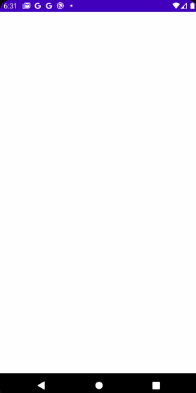
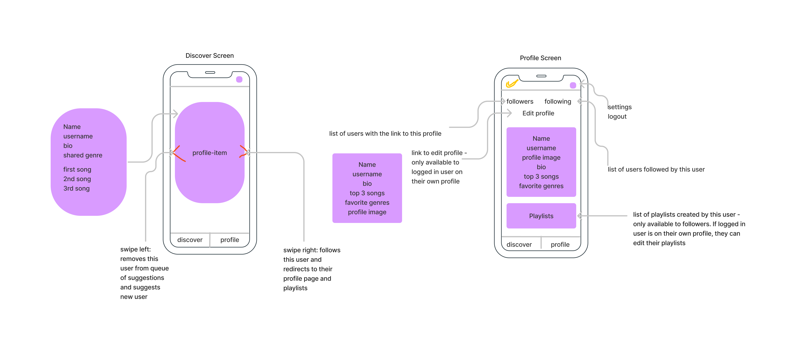

# bopshare

## Table of Contents
1. [Overview](#overview)
2. [Product Spec](#product-spec)
3. [Navigation](#wireframes)
4. [Schema](#schema)

## Overview
### Description
An app for real people to create playlists and then be suggested other users (based on favorite genres) in dating app style. A user is recommended, their top three songs in the shared genre will start playing, and then user can swipe right or left on the recommendation. If user swipes right, they can view the rest of the recommended user's music and start adding songs from their playlists to their own.

### App Evaluation
- **Category:** Music Sharing
- **Mobile:** This app will be developed for mobile, but could potentially be viable on desktop or tablet later on.
- **Story:** Users are recommended songs from other user’s playlists and can swipe right or left the recommendation. If user swipes right, they can view more songs in the recommended user’s playlists.
- **Market:** Anyone who uses Spotify and likes getting recommended new songs
- **Habit:** This app can be used as frequently as a user desires, depending on how much new music user wants to hear.
- **Scope:** This app is a pairing to the existing Spotify app so users can have more recommendations. It can have as many users as Spotify itself.

## Product Spec

### 1. User Stories (Required and Optional)

**Required Must-have Stories**

- [x] User signs in through Spotify to access their account
- [ ] User can pick their top 3 songs for each of their favorite genres
- [ ] User can discover new users to follow by swiping right or left on their top 3 songs in a shared genre
- [x] User can display profile information (bio, following, followers)
- [x] User's playlists appear in profile and can be clicked on and listened to
- [ ] User can access the music and profiles of those they are following
- [x] User can log out

**Optional Nice-to-have Stories**

- [ ] User can create new playlists or add to existing playlists in-app
- [ ] Settings section (accessiblity, notifications, general, etc.)
- [ ] User can choose whether to find music by shared/similar artists rather than by shared genres
- [ ] User can choose to have their genre and artist preferences auto-generated based on their playlists rather than choosing manually
- [ ] User can choose to get random recommendations (not based on any of their favorites) or popular recommendations (based on what most people are listening to)
- [ ] A new user completes a short questionnaire to choose which playlists are publically available and which genres they want to display

### Video Walkthrough

Here's a walkthrough of implemented user stories:

GIF created with [LiceCap](http://www.cockos.com/licecap/).

### 2. Screen Archetypes

* Spotify login
* Discover
   * Allows user to discover other users with similar music taste by swiping right or left
* Profile
   * Allows user to view their playlists, bio, followers, and following. Also allows user to edit their top 3 songs for each of their favorite genres
* Followers
   * Allows user to view the profiles of those following them
* Following
   * Allows user to view the profiles of users they are following

### 3. Navigation

**Tab Navigation** (Tab to Screen)

* Discover
* Profile
* Logout

**Flow Navigation** (Screen to Screen)

* Discover
   * If swipe right, choice between continuing to discover or going to that user's profile
* Profile
   * Link to edit profile
   * Link to followers page
   * Link to following page
* Followers
   * List of users where each item is a link to that user's profile
* Following
   * List of users where each item is a link to that user's profile

## Wireframes
 

## Schema 
### Models
#### User

   | Property       | Type     | Description |
   | -------------  | -------- | ------------|
   | objectId       | String   | unique id for the user (default field) |
   | name           | String   | user's full name |
   | username       | String   | username |
   | accessToken    | String   | Spotify access token for HTTP requests |
   | image          | File     | profile image |
   | followersCount | Number   | number of followers the user has |
   | followingCount | Number   | number of people he user is following |
   | topSongs       | Array of Files | user's top 3 favorite songs |
   | genres         | JSON Object | includes all genres the user listens to, along with their top 3 songs in each genre |
   | followers      | Array of Pointers to Users | followers |
   | following      | Array of Pointers to Users | following |
   | bio            | String | user's bio |
   | dislikedUsers  | Array of Pointers to Users | list of users that logged in user swiped left on |

#### Playlist

   | Property      | Type     | Description |
   | ------------- | -------- | ------------|
   | objectId      | String   | unique id for the user playlist (default field) |
   | user          | Pointer to User | user that created the playlist |
   | image         | String     | url to playlist image |
   | id            | String    | Spotify id for playlist |
   | name          | String | the name of the playlist |
   | public        | Boolean | whether the playlist is publically accessible |
   | description   | String | A description of the playlist set by user |
   | genres        | Array of Strings   | all the genres on the playlist |
   
#### Song

   | Property      | Type     | Description |
   | ------------- | -------- | ------------|
   | objectId      | String   | unique id for the user song (default field) |
   | playlist      | Pointer to Playlist | playlist on which the song is saved |
   | image         | String     | url to album cover of song |
   | id            | String    | Spotify id for song |
   | name          | String | the name of the song |
   | artist        | String | the song's artist |

### Networking
#### List of network requests by screen
   - Discover Screen
      - (Read/GET) Query a finite number of unfollowed users with shared genres
      - (Update/PUT) Update followers if a new user is liked
   - Profile Screen
      - (Read/GET) Query user's top 3 songs
      - (Read/GET) Query user's bio
   - Profile Screen (Playlist section)
      - (Read/GET) Query all playlists with this user as an author
      - (Delete) Delete existing playlist (if logged in user owns playlist)
   - Profile Screen (Followers Section)
      - (Read/GET) Query all followers of logged in user
      - (Update/PUT) Follow a follower
      - (Delete) Block a follower
   - Profile Screen (Following Section)
      - (Read/GET) Query all other users followed by logged in user
      - (Delete) Unfollow
   - Create New Playlist Screen
      - (Create/POST) Create new playlist
   - Individual Playlist Screen
      - (Create/POST) Add a new song to this playlist if owned by logged in user
      - (Read/GET) Get list of songs on this playlist
      - (Create/POST) Add song from this playlist to another playlist owned by logged in user
   - Edit Profile Screen
      - (Update/PUT) Change top 3 favorite songs, bio, favorite genres, or username
 
